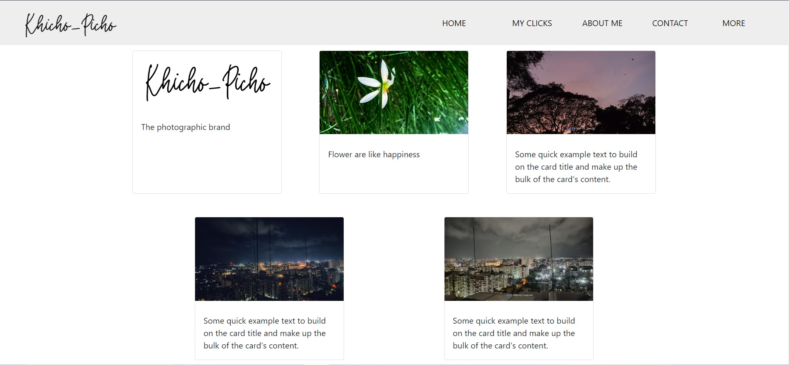
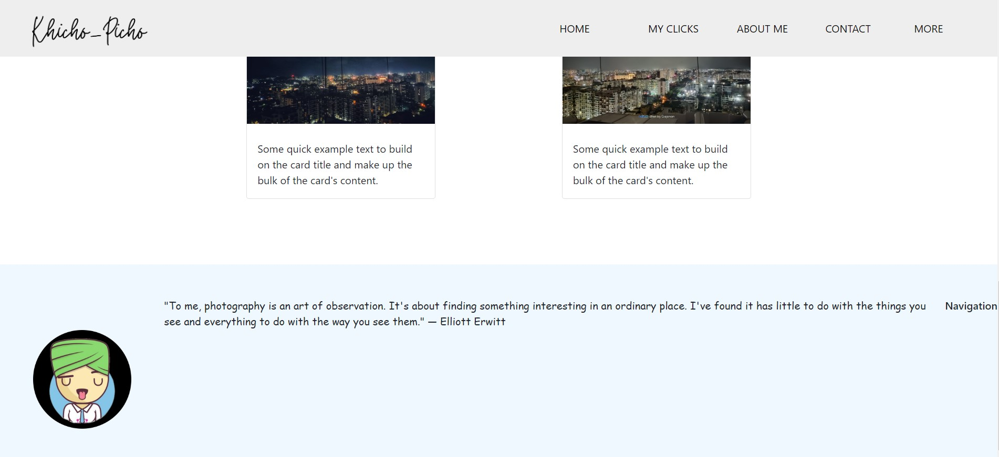

<h1 align="center">Khicho-Picho Named Photographic Web</h1>

    <b>A photographic web application to capture and share your moments.</b>

<h2>Features</h2>
<ul>
    <li>Capture high-quality photos directly from your browser</li>
    <li>Upload and manage your photo gallery</li>
    <li>Share photos with friends and family</li>
    <li>Explore photos from other users</li>
</ul>

<h2 id="installation">Installation</h2>

1. Clone the repository using the following command : 

<pre><code>git clone https://github.com/GajananJoshi0601/spotify-clone.git</code></pre>

2. Open and Extract It.

3. Now run live server.

4 .Open index.html file in browser.

5. Now just right click and open with live server

6. Enjoy the images with high quality resolution.

<h2 id="technologies">Technologies</h2>
<ul>
    <li>HTML</li> 
    <li>CSS</li>
    <li>JavaScipt</li>
</ul>

<h2 id="overview">Quick Overview of the UI</h2>

Here are some screenshots showcasing the main features of our Spotify Clone:

    
     
    <em>Home Page</em>

    
     
    <em>Cards Page</em>

    
     
    <em>Footer Page</em>

<h2>Contributing</h2>

Contributions are welcome! Please feel free to submit a Pull Request or open an issue for any bugs or feature requests.

<h2>License</h2>

This project is licensed under the Project Owner : Gajanan Joshi

<h2>Contact</h2>

If you have any questions or feedback, please feel free to reach out at <a href="mailto:gajananjoshi0601@gmail.com">gajananjoshi0601@gmail.com</a>.

<h2>Acknowledgements</h2>
<ul>
    <li>Thanks to all our contributors for their hard work!</li>
    <li>Special thanks to the open source community for providing valuable resources and tools.</li>
</ul>

</body>
</html>
